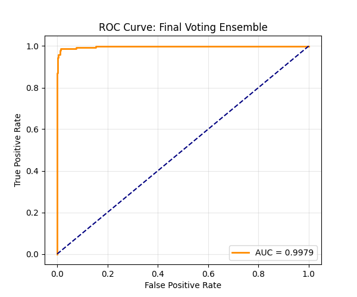

# 📩 SMS Spam Classifier:


A robust Machine Learning pipeline to detect SMS Spam with high precision. This project evolves from classical NLP techniques (TF-IDF + Naive Bayes) to advanced Ensemble methods, and finally to Deep Learning embeddings using **BERT**.

## 🚀 Project Overview

Spam detection is an imbalanced classification problem. This project focuses not just on accuracy, but on **Precision** (avoiding false positives) and **Model Stability**.

**Key Approaches:**
1.  **Classical ML Ensemble:** A Soft-Voting classifier combining Tuned Naive Bayes, Random Forest, and SVM.
2.  **Deep Learning Approach:** Using `all-MiniLM-L6-v2` (BERT) to generate context-aware embeddings fed into Logistic Regression.

## 🧠 Key Features

* **Smart Preprocessing:**
    * Replaces numbers with `<num_token>` instead of removing them, preserving context like "winning cash" or "calling numbers."
    * Full Part-of-Speech (POS) Lemmatization for accurate word reduction.
* **Handling Class Imbalance:**
    * Utilized `class_weight='balanced'` across models to penalize spam misclassification.
    * Optimized for **F1-Score** rather than raw Accuracy.
* **Ensemble Strategy:**
    * **Soft Voting:** Averages predicted probabilities rather than hard labels for more nuanced decisions.
    * **Weighted Voting:** Prioritizes models with higher precision to reduce false alarms.

## 🛠️ Tech Stack

* **Language:** Python
* **Libraries:** `scikit-learn`, `pandas`, `numpy`, `seaborn`, `matplotlib`
* **NLP:** `nltk`, `sentence-transformers` (HuggingFace)

## 📊 Evaluation Metrics

The models are evaluated using a custom pipeline that generates **Confusion Matrices**, **ROC-AUC Curves**, and **F1-Scores**.

### Sample Performance (Ensemble)

| Model | F1-Score | ROC-AUC | Notes |
| :--- | :---: | :---: | :--- |
| Tuned Naive Bayes | 0.92 | 0.96 | Fast baseline |
| **Final Voting Ensemble** | **0.94** | **0.99** | **Best Balance** |
| BERT + LogReg | 0.95 | 0.99 | Best Semantic Recall |

## ⚙️ How to Run

1.  **Clone the repo:**
    ```bash
    git clone https://github.com/vishalgupta-git/sms-spam-detection-nlp.git
    cd sms-spam-detection-nlp
    ```

2.  **Install requirements:**
    ```bash
    pip install -r requirements.txt
    ```

3.  **Run the Notebook:**
    Open `notebook.ipynb` in Jupyter or VS Code. The pipeline will:
    * Download necessary NLTK data.
    * Preprocess the raw SMS text.
    * Tune models via GridSearch and train the Ensemble.
    * Automatically save plots to the `metrics/` folder.

## 📈 Visualizations

**ROC Curve (Final Ensemble):**



> The model demonstrates excellent separation between classes with an AUC near 1.0.

---

**Author:** Vishal Gupta
**License:** MIT
